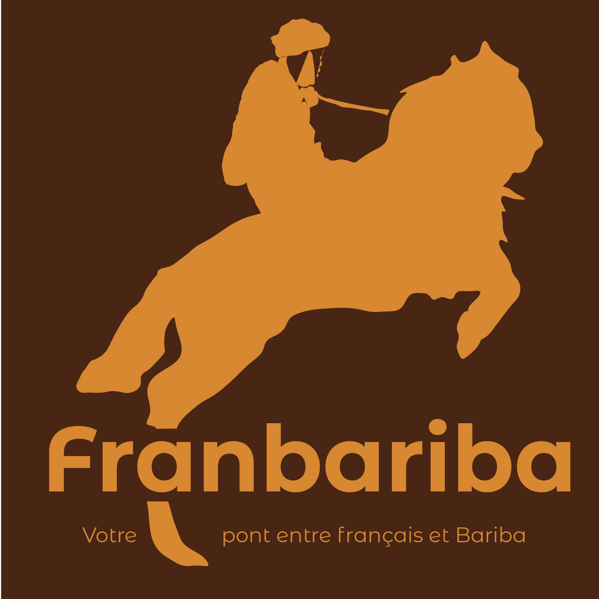

# FranBariba

📖 Nouvelle version moderne du dictionnaire et traducteur **Français vers Bariba (Baatonu)**. 
Cette refonte vise à rendre l’application **plus rapide, plus accessible**.

## Librairies

- **Isar:** Base de données locale
- **JSON:** Format des données pour la base de mots
- **Sweet Nav Bar:** [Code source](https://github.com/AbdallahAwd/sweet_nav_bar) pour la **bottom navigation bar**.  
- **Flutter**

### Nouveau logo officiel

### Nouvelle interface utilisateur

## API publique

Une **API REST publique** sera mise en ligne prochainement pour exposer le dictionnaire en JSON. 
*(Pas encore disponible — en cours de développement)*

## Licence

Ce projet est maintenu et propriété de **SILIDDOR**.  
Il est ouvert au monde, gratuit et chacun peut y contribuer sous réserve de respecter la licence.

- **Code source** : distribué sous licence [Apache 2.0](https://www.apache.org/licenses/LICENSE-2.0).  
  Vous pouvez l’utiliser, le modifier et le redistribuer librement, à condition de conserver la licence et d’indiquer la provenance.

- **Données linguistiques (dictionnaire et contenus textuels)** : protégées sous licence [Creative Commons BY-NC-SA 4.0](https://creativecommons.org/licenses/by-nc-sa/4.0/).  
  Elles peuvent être partagées et adaptées librement **à condition** :  
  - d’attribuer la source (**SILIDDOR**),  
  - de ne pas en faire un usage commercial sans accord préalable,  
  - de partager sous la même licence.
